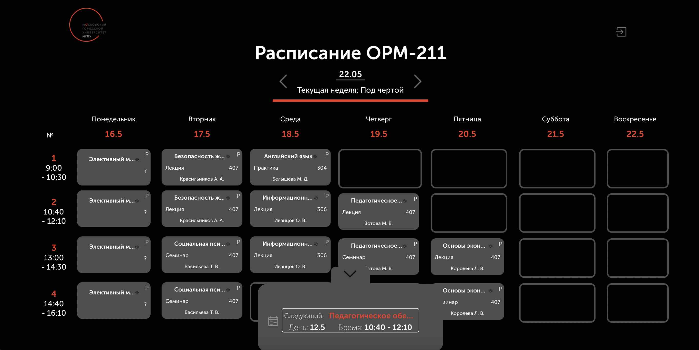

# Расписание для ВУЗ'а

-------------------------

[Ссылка на страницу](https://mgpu-orm211.netlify.app/)

-------------------------

Проект удобного расписания для ВУЗ'а. Можно смотреть свое расписание на нужную дату, смотреть выходные дни, переходить на доп. материалы(Ссылка на Google диск) к парам, смотреть аудитории. Реализован окно-слайдер для просмотра текущей и следующей пары. Реализована темная/светлая темы.

------------------

## Основные блоки

1. Блок управления (Переключение недель и календарь)
2. Расписание
3. Всплывающие окна с подробной информацией о паре.
4. Окно-слайдер

------------------

## Использованные технологии

* HTML
* CSS
* JavaScript

------------------

## Планы по доработке проекта

1. Написать бек для проекта, для удобства заполнения расписания в личном кабинете
2. Подключить телеграм бота для ежедневной сводки.